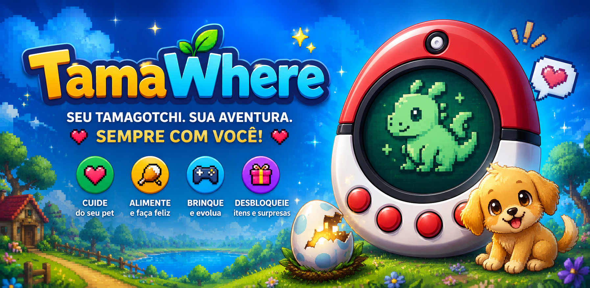
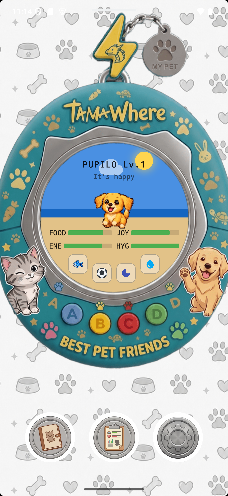
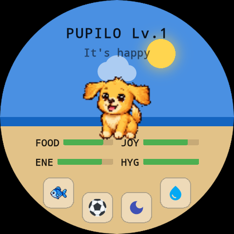
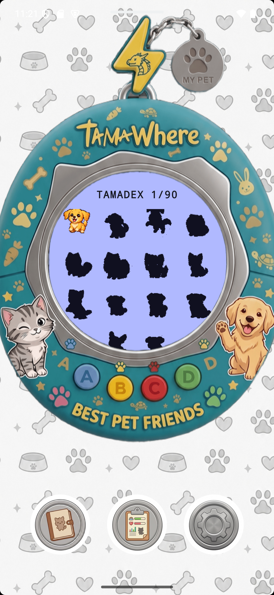

<div align="center">

  

  <br /><br />

  <h1>🐾 TamaWhere — Official Website & Community Hub</h1>

  <p>
    <strong>Seu Pet. Sua Aventura. Sempre com Você!</strong><br />
    <em>Your Pet. Your Adventure. Always With You!</em>
  </p>

  <p>
    <a href="https://apps.microsoft.com/detail/9mxcjn23mzp7?hl=pt-BR&gl=BR" target="_blank">
      
    </a>
    <a href="https://www.meta.com/pt-br/experiences/tamawhere/1620772423042196/" target="_blank">
      
    </a>
    <a href="https://play.google.com/store/apps/details?id=com.xxfalcoonx.tamawhere" target="_blank">
      
    </a>
    
    
    
  </p>

  <p>
    Código-fonte oficial da landing page institucional e hub comunitário do jogo <strong>TamaWhere</strong>.<br />
    Desenvolvido com estética <em>neo-retro pixel art</em>, performance extrema e suporte nativo a múltiplos idiomas.
  </p>

</div>

---

## 🎮 Sobre o TamaWhere

O **TamaWhere** é o primeiro jogo de bichinho virtual (Virtual Pet) universal desenvolvido para funcionar de forma integrada entre o seu **Desktop Windows (Microsoft Store & Steam)**, **Meta Quest (painel 2D flutuante no Horizon OS)**, **Smartwatch (Wear OS)** e **Smartphone (Android)**.

Com uma engine aberta e modular, o jogo traz de volta a nostalgia clássica dos anos 90 combinada com as tecnologias mais modernas de vestíveis:

- 🍖 **Cuidado em Tempo Real**: Alimente, dê banho, limpe a sujeira e monitore status de fome, energia, humor e peso.
- 🎮 **Minigames**: Jogue Pedra-Papel-Tesoura, treine força ou persiga a bola em fuga para subir de nível e ganhar experiência.
- ✨ **Linhas Evolutivas**: Seu estilo de cuidado dita o rumo do crescimento do seu companheiro.
- 🪟 **Desktop Windows Completo**: Jogue com atalhos de teclado ágeis, modo carcaça retrô ou janela compacta (`F2`), minimização na bandeja (`Tray`) e notificações nativas.
- 🥽 **Meta Quest VR & MR**: Interaja com seu pet em um **painel espacial flutuante 2D** no Horizon OS com controle por ponteiros ou Hand Tracking em VR ou Passthrough.
- ⌚ **Wear OS Imersivo**: Interaja direto no mostrador redondo do relógio inteligente com tiles, complicações e toques táteis rápidos.
- 📦 **Engine Aberta (TamaPacks)**: Qualquer pessoa da comunidade pode criar seus próprios universos, sprites e sons em pacotes `.tamapack`.
- 🐱 **Bichinhos Reais no Jogo**: Serviço exclusivo que imortaliza animais de estimação reais em pixel art artesanal de 3 estágios.

---

## 🌐 Recursos da Landing Page

Este site foi construído para encantar os visitantes à primeira vista, transmitindo a personalidade mágica e retrô do jogo:

| Recurso | Detalhes |
|---|---|
| **🇧🇷 / 🇺🇸 Sistema Bilíngue (i18n)** | Suporte completo a Português e Inglês com detecção automática do navegador e persistência via `localStorage`. |
| **🎨 Banner Dinâmico** | O banner principal adapta-se automaticamente ao idioma selecionado (`banner_pt.png` / `banner_en.png`). |
| **📱 Mockups Interativos** | Alternância fluida entre molduras realistas de **Smartphone** e **Smartwatch redondo (Wear OS)** com 12 capturas reais do app. |
| **🐾 TamaDex Showcase** | Vitrine com **33 criaturas curadas** exibindo GIFs animados originais, filtros por elemento (*Fogo, Água, Planta, Dragão, Psíquico, Elétrico, Lendários*) e selos de raridade. |
| **🐱 Vitrine Custom Pet** | Exibição dos 7 gatinhos reais imortalizados no jogo (*Barry Allen, Mingau, Zara, Zelda, Didi, Simba e Banana*), comparando fotos reais com o fluxo evolutivo de 3 estágios em pixel art. |
| **⬇️ Download do Gen 1 Pack** | Disponibilização direta do pacote base de lançamento (**151 criaturas**, ~12.8 MB) com botão de **"Copiar URL para o Jogo"** com notificação em balão verde (*toast*). |
| **🛠️ Guia de Modding** | Instruções de como criar pacotes próprios com especificações de grids de pixel art (64x64, 80x80, 96x96) e configuração JSON. |
| **✨ Efeitos Visuais & Performance** | Partículas de corações e fagulhas em HTML5 Canvas, glassmorphism com bordas iluminadas e zero dependências pesadas. |

---

## 📸 Demonstração Visual

<div align="center">
  
  
  
</div>

---

## 🛠️ Tecnologias Utilizadas

- **HTML5 Semântico**: Estrutura acessível com metatags otimizadas para SEO, OpenGraph e Twitter Cards.
- **Vanilla CSS (Modern CSS)**:
  - Variáveis CSS (Design Tokens)
  - Glassmorphism com `backdrop-filter: blur(16px)`
  - Flexbox e CSS Grid responsivos
  - Tipografia via Google Fonts: **Outfit** (UI moderna) e **Press Start 2P** (acentos retrô)
- **Vanilla JavaScript (ES6+)**:
  - Motor de tradução customizado (`i18n.js`)
  - Sistema de partículas leves em HTML5 Canvas
  - Galeria interativa com troca dinâmica de temas e molduras
  - Clipboard API para cópia do link do TamaPack
- **Netlify**:
  - Arquivo `netlify.toml` pré-configurado com headers de segurança
  - Suporte total a **CORS** (`Access-Control-Allow-Origin = "*"`) para que o aplicativo Flutter consiga baixar pacotes diretamente da web.

---

## 📁 Estrutura de Pastas

```
TamaWhere_website/
├── index.html              # Landing page principal
├── css/
│   └── style.css           # Estilos completos e responsividade
├── js/
│   ├── i18n.js             # Dicionário de tradução e gerenciador de idioma
│   └── main.js             # Comportamentos interativos, filtros e mockups
├── img/
│   ├── banners/            # Banners promocionais em alta resolução (PT e EN)
│   ├── screenshots/        # 12 capturas de tela oficiais (Mobile e Wear OS)
│   ├── sprites/            # GIFs animados das criaturas em pixel art
│   ├── icons/              # Ícone oficial de 512x512
│   └── custom-pets/        # Fotos dos gatinhos reais participantes
├── downloads/
│   └── gen1.tamapack       # Arquivo de pacote oficial (~12.8 MB)
├── _redirects              # Regras de redirecionamento para o Netlify
├── netlify.toml            # Configuração de build, CORS e caching do Netlify
└── README.md               # Documentação do repositório
```

---

## 💻 Como Rodar Localmente

Como o projeto é construído em tecnologias web nativas (HTML/CSS/JS puro), não é necessário instalar dependências com `npm`:

### Opção 1: Usando Python
```bash
# Clone o repositório
git clone https://github.com/davidkalil10/TamaWhere_Website.git
cd TamaWhere_Website

# Inicie um servidor estático local
python -m http.server 8080
```
Abra seu navegador em `http://localhost:8080`.

### Opção 2: Usando Node.js / npx
```bash
npx serve .
```

---

## ⭐ Encomende seu Pet Real no Jogo!

Quer imortalizar seu próprio bichinho de estimação (gato, cachorro, pássaro, etc.) dentro do TamaWhere?

Oferecemos serviço de comissão sob medida:
1. **Pixel Art Feita à Mão**: Desenhamos seu companheiro em 3 estágios evolutivos (*Filhote ➔ Jovem ➔ Adulto Real*).
2. **Pacote Completo de Animações**: Animações de repouso, mastigando comidinhas, tomando banho, brincando e dormindo.
3. **Disponibilidade Imediata**: Entregamos seu arquivo exclusivo `.tamapack` pronto para importar e jogar no relógio e no celular!

📬 **Entre em contato para solicitar um orçamento**: [davidkalil@outlook.com](mailto:davidkalil@outlook.com?subject=Custom%20Pet%20TamaWhere%20-%20Solicita%C3%A7%C3%A3o%20de%20Or%C3%A7amento)

---

## 🔗 Links Oficiais

- 🪟 **Microsoft Store (Windows)**: [Baixe o TamaWhere na Microsoft Store](https://apps.microsoft.com/detail/9mxcjn23mzp7?hl=pt-BR&gl=BR) *(Disponível)*
- 🥽 **Meta Horizon Store (Meta Quest)**: [Visualizar no Meta Quest](https://www.meta.com/pt-br/experiences/tamawhere/1620772423042196/) *(Em processo de publicação)*
- 📲 **Google Play Store (Android & Wear OS)**: [Baixe o TamaWhere no Google Play](https://play.google.com/store/apps/details?id=com.xxfalcoonx.tamawhere) *(Em processo de publicação)*
- 🌐 **Website Oficial**: [tamawhere.netlify.app](https://tamawhere.netlify.app/)
- 🔒 **Política de Privacidade**: [Visualizar Documento](https://drive.google.com/file/d/1L6vecvDLhHIdrcVIpfXwREDzxlfBBZ7p/view)
- ✉️ **Contato & Suporte**: [davidkalil@outlook.com](mailto:davidkalil@outlook.com)

---

<div align="center">
  <p>© 2026 <strong>TamaWhere</strong>. Desenvolvido com paixão por <strong>David Kalil Braga</strong>.</p>
</div>
